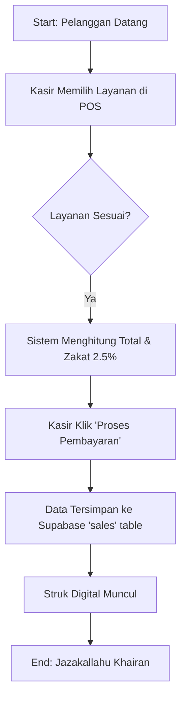

# Rusdi Barbershop - Technical Documentation (Modul 2 & 3)

## 1. Transaction Flowchart (Logic Flow)
Below is the logic flow for a standard transaction in Rusdi Barbershop:

## 2. Risk Analysis & Fraud Prevention (Problem Statement)
Berikut adalah 3 risiko kecurangan yang diidentifikasi dalam operasional barbershop manual dan bagaimana aplikasi ini mengatasinya:

### Risiko 1: Harga Siluman
- **Masalah**: Kasir menaikkan harga secara lisan kepada pelanggan dan mengambil selisihnya.
- **Pencegahan**: Harga ditarik otomatis dari database Supabase (`products` table). Kasir tidak memiliki akses untuk mengubah harga di UI POS, sehingga total yang dibayar pelanggan pasti sesuai dengan sistem.

### Risiko 2: Transaksi Tidak Dicatat (Off-book Sales)
- **Masalah**: Layanan diberikan namun tidak dimasukkan ke sistem/catatan agar uang bisa diambil pribadi.
- **Pencegahan**: Implementasi fitur **AI Audit Result** yang mencatat waktu operasional secara real-time. Manajemen dapat memantau jika ada ketidaksesuaian antara jam sibuk dan jumlah transaksi yang masuk.

### Risiko 3: Manipulasi Struk Manual
- **Masalah**: Kasir menggunakan nota kertas manual yang bisa dipalsukan atau tidak berurutan.
- **Pencegahan**: Aplikasi menghasilkan struk digital dengan **Transaction ID** yang unik dan berurutan secara otomatis melalui database, memudahkan pelacakan (Audit Trail).

## 3. Infrastructure Checklist (Modul 3)
- **Vercel URL**: [https://rusdibarbershop.vercel.app/](https://rusdibarbershop.vercel.app/)
- **GitHub Repo**: [https://github.com/faidizzahaddala-ui/Rusdi-Barbershop](https://github.com/faidizzahaddala-ui/Rusdi-Barbershop) (Set to PUBLIC)
- **Supabase Tables**:
  - `profiles`: Data pengguna/kasir.
  - `products`: Katalog jasa (Haircut, Wash, etc).
  - `sales`: Catatan transaksi harian.
