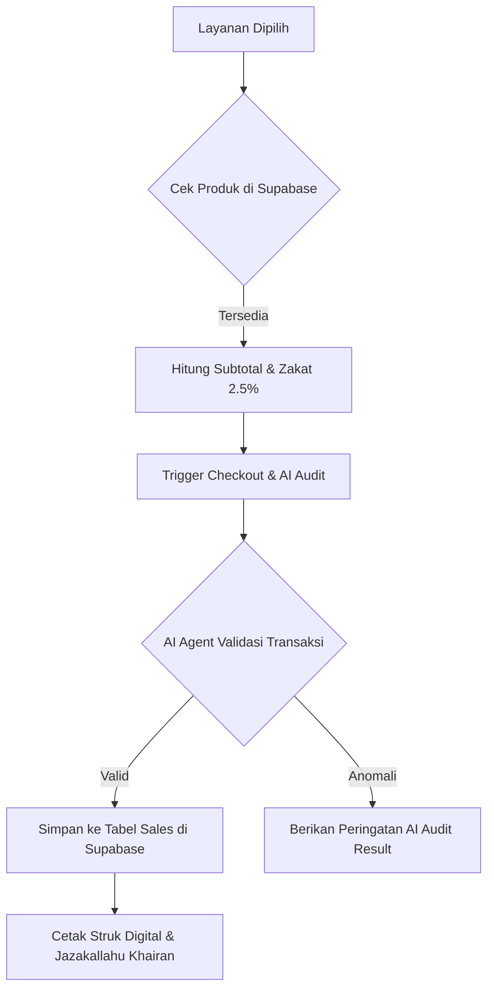

# Rusdi Barbershop POS - Syariah & Premium

Sistem Point of Sale (POS) modern berbasis cloud untuk manajemen barbershop premium dengan prinsip Syariah.

## 1. Alur Transaksi (Mermaid Flowchart)
Berikut adalah alur bagaimana data mengalir dari pemilihan barang hingga audit AI:

## 2. Identifikasi Node Logika (Logic Integration)
Aplikasi ini memiliki 3 node utama dalam aliran datanya:

- **Trigger Node**: Berada pada komponen `POSInput.jsx` fungsi `handleCheckout`. Node ini menangani klik tombol "Proses Pembayaran" dari UI.
- **AI Node**: Terintegrasi pada komponen **AI Audit Result**. Prompt AI akan memvalidasi apakah harga yang dimasukkan sesuai dengan standar katalog dan mendeteksi potensi kecurangan (*fraud*).
- **Database Node**: Terletak di file `lib/supabase.js`. Mengambil data katalog dari tabel `products` dan mengirim hasil akhir transaksi ke tabel `sales`.

## 3. Laporan Logika & Problem Statement (OBE)
### Risiko Kecurangan (Fraud) & Pencegahan:
1. **Harga Siluman**: Kasir merubah harga manual. **Solusi**: Harga ditarik *read-only* dari database `products`.
2. **Transaksi Tidak Dicatat**: Uang masuk kantong pribadi. **Solusi**: Sistem **AI Audit** merekam jejak waktu operasional vs jumlah transaksi masuk.
3. **Manipulasi Struk**: Menggunakan nota palsu. **Solusi**: Sistem menghasilkan **ID Transaksi Unik** yang langsung sinkron ke Supabase.

## 4. Tampilan Kasir
Pastikan fitur **"AI Audit Result"** sudah terlihat di dashboard kasir sebagai syarat kelengkapan Modul 2.

---
© 2024 Rusdi Barbershop Group
Proyek ini dikembangkan dengan memegang teguh prinsip:
> *"Tunaikanlah amanah kepada orang yang mempercayaimu."*

- **Autentikasi Aman**: Login dan Registrasi vendor terintegrasi dengan **Supabase**.
- **Kasir Cerdas**: Pengelolaan transaksi cepat dengan antarmuka modern.
- **Kalkulasi Zakat**: Perhitungan Zakat Niaga (2.5%) otomatis pada setiap transaksi.
- **Navigasi Mulus**: Pengalaman Single Page Application (SPA).

## 🛠️ Tech Stack
- **Frontend**: React, Vite, Tailwind CSS.
- **Backend**: Supabase (Auth & Database).
- **Deployment**: Vercel.

---
*Proyek ini merupakan bukti praktikum yang menjunjung tinggi integritas dan kualitas teknis.*